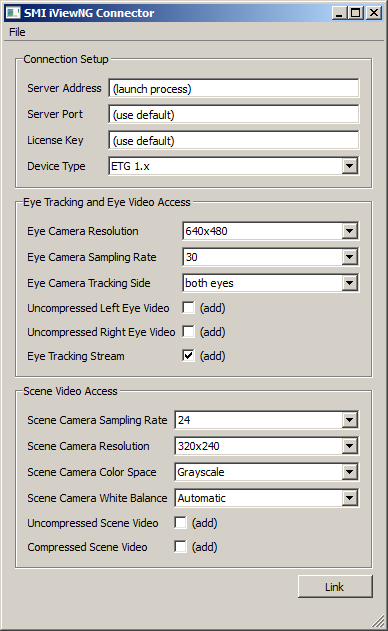

# Overview

The iViewNG application is part of the LSL distribution. This application is currently primarily targeting the eye tracking glasses by SMI, but may support other hardware in the future. You can get access to both the gaze data and video from the cameras on the device.

# Usage
  * Make sure that you have downloaded and installed the drivers for your eye tracking glasses and that the device is plugged in and ready. A good way to ensure this is to download the iView ETG software from www.smivision.com (which installs the driver automatically) and then check whether that program can access the device.

  * Before you can use the LSL app, you need to also download the iViewNG SDK from www.smivision.com (note that this program requires the "iViewNG SDK", not the older  "iView X SDK"; there is a different app for the old SDK). This program was made for version 2.0.1 of the SDK. At the time of this writing, the download page is: http://www.smivision.com/en/gaze-and-eye-tracking-systems/support/software-download.html (alternatively you might try to google for iViewNG SDK). Please make sure that your eye tracking model is supported by the SDK. Note the installation location and after you have installed the drivers, copy the contents of the bin/bin-Windows7-32, lib/lib-Windows7-32, and optionally include/ folders into the folder of the LSL app. You should now be able to run the app!

  * Start the iViewNG app. If you get an error message you might have copied the wrong folders or use an incompatible version of the SDK (try to obtain version 2.0.1 in that case). You should see a window like the following.
> 

  * The server address allows you to specify whether you want to launch a lightweight eye tracking server in the background, or whether you want to connect to a running instance (e.g., of the iView ETG program). By default this app will start a lightweight server in the background, unless you explicitly specify the IP address of a machine that runs a server. In this mode no configuration should be necessary as long as your eye tracker is correctly installed (USB drivers, etc), which requires that you also install the regular tracking software. However, the downside is that you will not be able to calibrate your tracker as this program has no calibration GUI on its own (although the default calibration is okay for testing). If you run an SMI tracking server locally, you can use the IP address 127.0.0.1 to connect to it. The benefit of using a separate tracking server is that it allows you to calibrate the eye tracker in its GUI and troubleshooting is much easier (if you run into issues you should always first confirm that your glasses work with the official tracking programs before contacting us). You can get the server program from SMI (one server is called iViewETG for the eye tracking glasses).

  * The server port can be kept at the default value unless a special configuration was used to start the server. You can ignore the license key and device type settings as of this writing, but in the future, advanced features might be unlocked based on your license key.

  * The five checkboxes allow you to select which streams you want to make available to LSL, and by default the program will only stream the gaze coordinates. In addition, you can add extra streams, such as the uncompressed video from the eye cameras or the scene camera, by checking the respective checkboxes labeled (add). Since these streams require a lot of network bandwidth, the default resolution and color space are set to low settings -- if your network connection can take it, you can increase these values (to no more than 400x300@24 on a 100MBit network and no more than 1280x960@24 on a 1GBit network, assuming full color video). In any case, it is strongly discouraged to record these streams to disk, as you will run out of disk space in no time -- instead, you should only record the Compressed Scene Video if you like to archive the scene video. However, you will need a specialized software to later decode this stream (which is in H.264 format); we (SCCN) do not currently supply such software.

  * Note that the user interface exposes more settings than what is supported by actual hardware, particularly recording at very high data rates. If you get an Invalid Parameter error, check your device's specs and try again with a lower setting. Also, some features might not work simultaneously -- for example, you may not be able to stream eye camera videos at both 640x480 and 60Hz, or record both the compressed and uncompressed scene video stream at the same time.

  * Click the "Link" button. If all goes well you should now have the selected streams on your lab network, all of which start with "iViewNG". The gaze stream has type "Gaze" and the video streams have "VideoRaw" and "VideoCompressed", respectively. Note that it takes a while until the program gets linked (since data needs to be exchanged with the server). You cannot close the app while it is linked. Also, when you unlink the app it will take a few seconds until it is fully unlinked. Successful state changes are indicated by the button label flipping from "Link" to "Unlink", or vice versa.

  * For subsequent uses you can save the settings in the GUI via File / Save Configuration. If the app is frequently used with different settings you might can also make a shortcut on the desktop that points to the app and appends to the Target field the snippet `-c name_of_config.cfg`.
